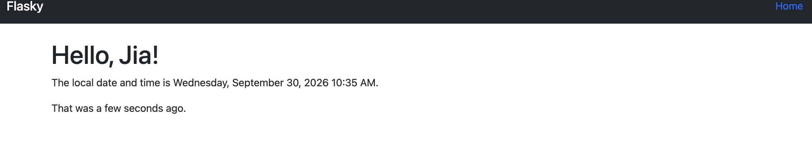
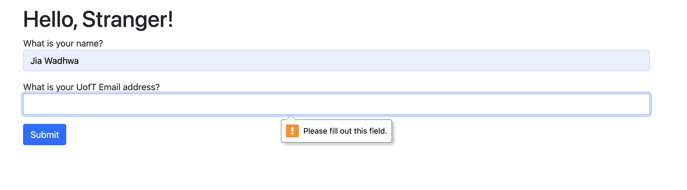
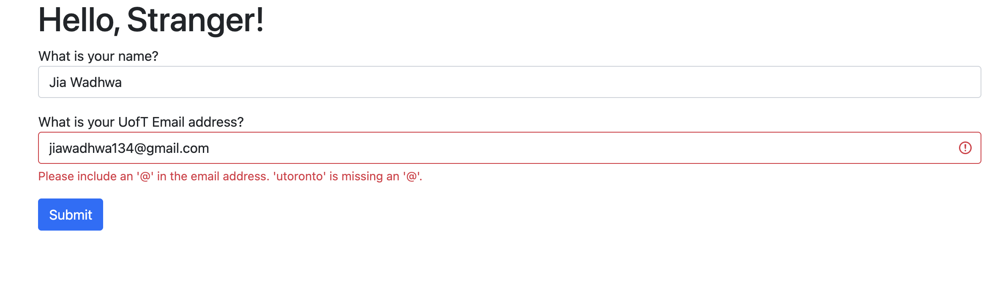

# Jia Wadhwa

## This repo is a clone of [https://github.com/miguelgrinberg/flasky](https://github.com/miguelgrinberg/flasky).


## Activity 1-3


## Activity 1-4
### Correct name and email


### Entering only name


### Enter name with non-UofT email



## Docker Setup

To build and run the app in Docker:

```bash
docker build -t flask-app .
docker run -p 5001:5000 flask-app
```

Access at: http://localhost:5001

